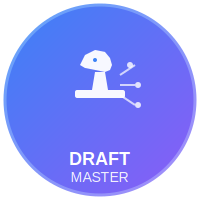

# Draft Master 🎮

<div align="center">
  
  
  <h3>AI-Powered League of Legends Draft Assistant</h3>
  
  <p>Master your draft phase with intelligent champion recommendations, team synergy analysis, and real-time strategic insights.</p>

  [](https://nextjs.org/)
  [](https://www.typescriptlang.org/)
  [](https://tailwindcss.com/)
  [](LICENSE)

  [Live Demo](https://draftmaster.app) · [Documentation](#documentation) · [Report Bug](https://github.com/yourusername/draft-master/issues) · [Request Feature](https://github.com/yourusername/draft-master/issues)
</div>

---

## 📖 Table of Contents

- [About](#about)
- [Features](#features)
- [Demo](#demo)
- [Getting Started](#getting-started)
- [Usage](#usage)
- [Documentation](#documentation)
- [Tech Stack](#tech-stack)
- [Project Structure](#project-structure)
- [Contributing](#contributing)
- [Roadmap](#roadmap)
- [License](#license)
- [Acknowledgments](#acknowledgments)

---

## 🎯 About

Draft Master is an AI-powered draft assistant for League of Legends that transforms how players approach champion selection. By combining cutting-edge AI technology with professional esports data, we provide real-time strategic insights that help players make smarter draft decisions.

### The Problem

In League of Legends, the draft phase is critical to winning, yet most players struggle with:
- **Information overload**: 160+ champions with complex interactions
- **Time pressure**: Making optimal decisions in 30-second windows
- **Limited knowledge**: Understanding team compositions and synergies
- **Lack of data**: No easy access to professional strategies

### The Solution

Draft Master provides:
- 🤖 **AI-Powered Recommendations** - Intelligent champion suggestions in real-time
- 📊 **Team Synergy Analysis** - Instant composition strength calculations
- 🎯 **Strategic Insights** - Professional tournament statistics and analysis
- ⚡ **Real-time Updates** - Sub-second response times during draft

---

## ✨ Features

### Core Features

#### 🤖 AI-Powered Recommendations
- Real-time champion suggestions based on current draft state
- Powered by Cerebras AI for ultra-fast inference
- Clear reasoning for each recommendation
- Considers team composition, counters, and meta trends

#### 🔄 Team Synergy Analysis
- Automatic calculation of team composition strength
- Identifies powerful champion combinations
- Warns about composition weaknesses
- Visual synergy score display

#### 📊 Professional Data Integration
- GRID Esports API integration for tournament statistics
- Team and player performance data
- Win rates, pick rates, and ban rates
- Multiple time window analysis

#### 🎯 Comprehensive Draft Analysis
- Full draft simulation (picks and bans)
- Post-draft team comparison
- Strategic win condition identification
- Detailed synergy breakdowns

#### 🎨 Beautiful UI/UX
- Clean, intuitive interface
- Dark/Light mode support
- Responsive design (works on all devices)
- Smooth animations and transitions

---

## 🎬 Demo

### Live Demo
Try it now: [draftmaster.app](https://draftmaster.app)

### Quick Start
1. Visit the website
2. Choose your side (Blue or Red)
3. Start drafting champions
4. Get AI recommendations in real-time
5. View comprehensive analysis when complete

---

## 🚀 Getting Started

### Prerequisites

- Node.js 18+ or Bun
- npm, pnpm, or bun package manager

### Installation

```bash
# Clone the repository
git clone https://github.com/yourusername/draft-master.git
cd draft-master

# Install dependencies
npm install
# or
pnpm install
# or
bun install
```

### Environment Setup

Create a `.env` file in the root directory:

```env
# AI Service (Required)
CEREBRAS_API_KEY=your_cerebras_api_key_here

# Esports Data (Required)
GRID_API_KEY=your_grid_api_key_here

# App Configuration (Optional)
NEXT_PUBLIC_APP_URL=http://localhost:3000
```

#### Getting API Keys

**Cerebras API Key:**
1. Visit [Cerebras Cloud](https://cloud.cerebras.ai/)
2. Sign up for an account
3. Navigate to API Keys section
4. Generate a new API key

**GRID API Key:**
1. Visit [GRID Esports](https://grid.gg/)
2. Sign up for developer access
3. Request an API key
4. Add to your environment variables

### Running the Application

```bash
# Development mode
npm run dev
# or
pnpm dev
# or
bun dev

# Open http://localhost:3000 in your browser
```

### Building for Production

```bash
# Build the application
npm run build

# Start production server
npm start
```

### Running Tests

```bash
# Run all tests
npm test

# Run tests in watch mode
npm run test:watch

# Run tests with coverage
npm run test:coverage
```

---

## 💡 Usage

### Basic Draft Flow

1. **Start a Draft**
   ```
   Navigate to / or /draft
   Click "Blue Side" or "Red Side"
   ```

2. **Make Selections**
   ```
   Click on a champion to select
   Click "Pick" or "Ban" to confirm
   ```

3. **View Recommendations**
   ```
   AI recommendations appear automatically
   Hover over recommendations for reasoning
   Click to select recommended champion
   ```

4. **Analyze Results**
   ```
   Complete all picks and bans
   Click "View Final Results"
   Review team comparison and insights
   ```

### Advanced Features

#### Team Search
```typescript
// Search for professional teams
1. Open team selector dropdown
2. Type team name (e.g., "T1", "G2")
3. Select team to view statistics
```

#### Synergy Analysis
```typescript
// View team synergy in real-time
- Synergy score updates automatically
- Green indicators show strong synergies
- Yellow warnings show composition issues
```

---

## 📚 Documentation

### Additional Documentation

- [**PITCH.md**](PITCH.md) - Business pitch and market analysis
- [**ARCHITECTURE.md**](ARCHITECTURE.md) - Technical architecture and design
- [**VIDEO-SCRIPT.md**](VIDEO-SCRIPT.md) - Video demo script and production guide
- [**DEMO.md**](DEMO.md) - Live demo guide and troubleshooting

### API Documentation

See [API Reference](#api-reference) section below.

---

## 🛠️ Tech Stack

### Frontend
- **Framework**: [Next.js 16](https://nextjs.org/) with App Router
- **Language**: [TypeScript 5](https://www.typescriptlang.org/)
- **Styling**: [Tailwind CSS 4](https://tailwindcss.com/) + [shadcn/ui](https://ui.shadcn.com/)
- **State Management**: [Zustand](https://github.com/pmndrs/zustand)
- **Forms**: [React Hook Form](https://react-hook-form.com/) + [Zod](https://zod.dev/)
- **Animations**: [Framer Motion](https://www.framer.com/motion/)

### Backend & AI
- **Runtime**: [Next.js API Routes](https://nextjs.org/docs/app/building-your-application/routing/route-handlers) (Serverless)
- **AI**: [Cerebras Cloud SDK](https://cerebras.ai/)
- **Data**: [GRID Esports API](https://grid.gg/)
- **Caching**: In-memory + future Redis integration

### Infrastructure
- **Hosting**: [Vercel](https://vercel.com/)
- **CDN**: Vercel Edge Network
- **Database**: Static JSON (future PostgreSQL)
- **Analytics**: Future integration

### Development Tools
- **Testing**: [Vitest](https://vitest.dev/)
- **Linting**: [ESLint](https://eslint.org/)
- **Formatting**: [Prettier](https://prettier.io/)
- **Git Hooks**: [Husky](https://typicode.github.io/husky/)

---

## 📁 Project Structure

```
draft-master/
├── public/                      # Static assets
│   ├── logo.svg                # App logo
│   ├── favicon.svg             # Favicon
│   ├── og-image.png            # Social media preview
│   └── robots.txt              # SEO configuration
│
├── src/
│   ├── app/                    # Next.js App Router
│   │   ├── layout.tsx         # Root layout
│   │   ├── page.tsx           # Home page
│   │   ├── draft/             # Draft page
│   │   │   └── page.tsx
│   │   └── api/               # API routes
│   │       ├── ai/
│   │       │   └── recommend/
│   │       └── grid/
│   │           ├── players/
│   │           ├── teams/
│   │           └── statistics/
│   │
│   ├── features/              # Feature modules
│   │   └── draft/
│   │       ├── components/    # React components
│   │       ├── hooks/         # Custom hooks
│   │       ├── services/      # Business logic
│   │       ├── types/         # TypeScript types
│   │       └── data/          # Static data
│   │
│   ├── components/            # Shared components
│   │   ├── ui/               # shadcn/ui components
│   │   └── layout/           # Layout components
│   │
│   ├── lib/                   # Utility functions
│   ├── hooks/                 # Shared hooks
│   └── types/                 # Shared types
│
├── docs/                       # Documentation
│   ├── PITCH.md
│   ├── ARCHITECTURE.md
│   ├── VIDEO-SCRIPT.md
│   └── DEMO.md
│
├── .env.example               # Environment variables template
├── next.config.ts             # Next.js configuration
├── tailwind.config.ts         # Tailwind configuration
├── tsconfig.json              # TypeScript configuration
├── vitest.config.ts           # Vitest configuration
└── package.json               # Dependencies
```

---

## 🔌 API Reference

### AI Recommendations

```typescript
POST /api/ai/recommend

Request:
{
  draftState: {
    phase: 'pick_1' | 'ban_1' | ...,
    bluePicks: Champion[],
    redPicks: Champion[],
    blueBans: Champion[],
    redBans: Champion[]
  },
  actionType: 'pick' | 'ban',
  userSide: 'blue' | 'red'
}

Response:
{
  recommendations: [
    {
      champion: Champion,
      score: number,
      reason: string
    }
  ]
}
```

### GRID Statistics

```typescript
GET /api/grid/teams?search=T1

Response:
{
  teams: [
    {
      id: string,
      name: string,
      logoUrl: string
    }
  ]
}

GET /api/grid/statistics?teamId=xxx&timeWindow=LAST_3_MONTHS

Response:
{
  statistics: {
    wins: number,
    losses: number,
    winRate: number,
    mostPicked: Champion[]
  }
}
```

---

## 🤝 Contributing

Contributions are welcome! Please follow these steps:

1. **Fork the repository**
2. **Create a feature branch**
   ```bash
   git checkout -b feature/amazing-feature
   ```
3. **Commit your changes**
   ```bash
   git commit -m 'Add some amazing feature'
   ```
4. **Push to the branch**
   ```bash
   git push origin feature/amazing-feature
   ```
5. **Open a Pull Request**

### Development Guidelines

- Follow the existing code style
- Write tests for new features
- Update documentation as needed
- Ensure all tests pass before submitting
- Use conventional commit messages

### Code of Conduct

Please read our [Code of Conduct](CODE_OF_CONDUCT.md) before contributing.

---

## 🗺️ Roadmap

### Q1 2025
- [x] MVP launch with core features
- [x] AI recommendation system
- [x] Team synergy analysis
- [ ] Public beta release
- [ ] User feedback collection

### Q2 2025
- [ ] User accounts and authentication
- [ ] Draft history and analytics
- [ ] Team collaboration features
- [ ] Mobile app development
- [ ] Pro tier launch

### Q3 2025
- [ ] Advanced AI models
- [ ] Custom champion pools
- [ ] Tournament integration
- [ ] API for third-party developers
- [ ] Multi-language support

### Q4 2025
- [ ] Mobile app launch
- [ ] B2B partnerships
- [ ] Advanced analytics dashboard
- [ ] Machine learning improvements
- [ ] International expansion

See the [open issues](https://github.com/yourusername/draft-master/issues) for a full list of proposed features and known issues.

---

## 📄 License

This project is licensed under the MIT License - see the [LICENSE](LICENSE) file for details.

---

## 📧 Contact

**Project Maintainer**: Draft Master Team

- Website: [draftmaster.app](https://draftmaster.app)
- Email: team@draftmaster.app
- Twitter: [@draftmaster](https://twitter.com/draftmaster)
- Discord: [discord.gg/draftmaster](https://discord.gg/draftmaster)

**Project Link**: [https://github.com/yourusername/draft-master](https://github.com/yourusername/draft-master)

---

## 🙏 Acknowledgments

### Technologies
- [Next.js](https://nextjs.org/) - The React framework for production
- [Cerebras](https://cerebras.ai/) - Ultra-fast AI inference
- [GRID Esports](https://grid.gg/) - Professional esports data
- [shadcn/ui](https://ui.shadcn.com/) - Beautiful UI components
- [Vercel](https://vercel.com/) - Deployment and hosting

### Inspiration
- League of Legends community
- Professional esports analysts
- Competitive players worldwide

### Special Thanks
- All beta testers and early users
- Contributors and supporters
- The open-source community

---

<div align="center">
  <p>Made with ❤️ for the League of Legends community</p>
  <p>
    <a href="#draft-master-">Back to top ↑</a>
  </p>
</div>
